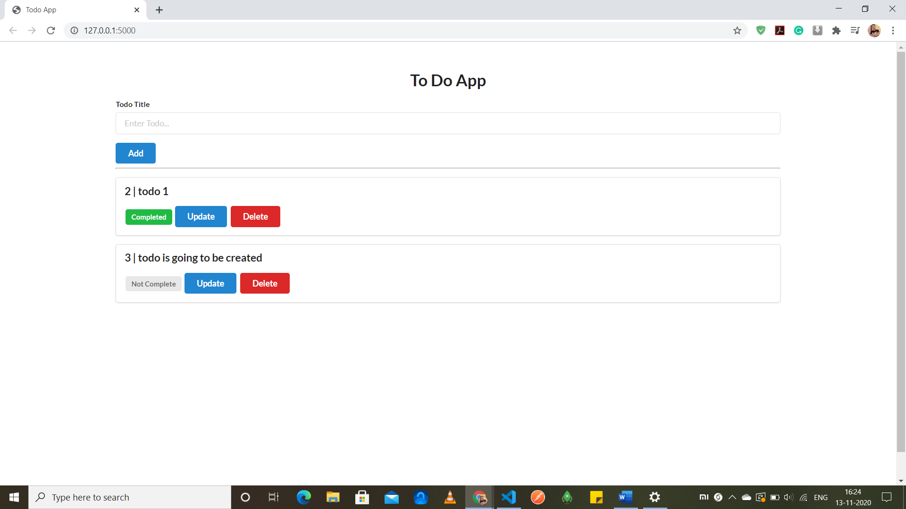

# flask-todo-app

_This application is built using Python as Backend and Flask as a framework to store the todo list and it has functionalities to edit and delete the todo lists._
<br> 
<br>

# App preview



Simple Flask Todo App using SQLAlchemy and SQLite database.

For styling [semantic-ui](https://semantic-ui.com/) is used.

### Setup
Create project with virtual environment

```console
$ mkdir myproject
$ cd myproject
$ python3 -m venv venv
```

Activate it
```console
$ . venv/bin/activate
```

or on Windows
```console
venv\Scripts\activate
```

Install Flask
```console
$ pip install Flask
$ pip install Flask-SQLAlchemy
```

Set envoronment variables in terminal
```console
$ export FLASK_APP=app.py
$ export FLASK_ENV=development
```

or on Windows
```console
$ set FLASK_APP=app.py
$ set FLASK_ENV=development
```

Run the app
```console
$ flask run
```
